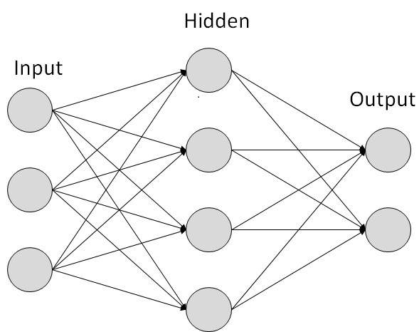

# Introduction to Deep Learning

### What is a (Neural Network) NN?

- Single neuron == linear regression
- Simple NN graph:
  - 
  - Image taken from [tutorialspoint.com](tutorialspoint.com)
- RELU stands for rectified linear unit is the most popular activation function right now that makes deep NNs train faster now.
- Hidden layers predicts connection between inputs automatically, thats what deep learning is good at.
- Deep NN consists of more hidden layers (Deeper layers)
  - 
  - Image taken from [opennn.net](opennn.net)
- Each Input will be connected to the hidden layer and the NN will decide the connections.
- Supervised learning means we have the (X,Y) and we need to get the function that maps X to Y.

### Supervised learning with neural networks

- Different types of neural networks for supervised learning which includes:
  - CNN or convolutional neural networks (Useful in computer vision)
  - RNN or Recurrent neural networks (Useful in Speech recognition or NLP)
  - Standard NN (Useful for Structured data)
  - Hybrid/custom NN or a Collection of NNs types
- Structured data is like the databases and tables.
- Unstructured data is like images, video, audio, and text.
- Structured data gives more money because companies relies on prediction on its big data.

