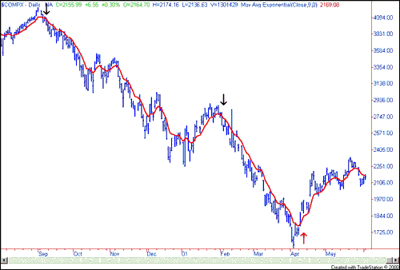
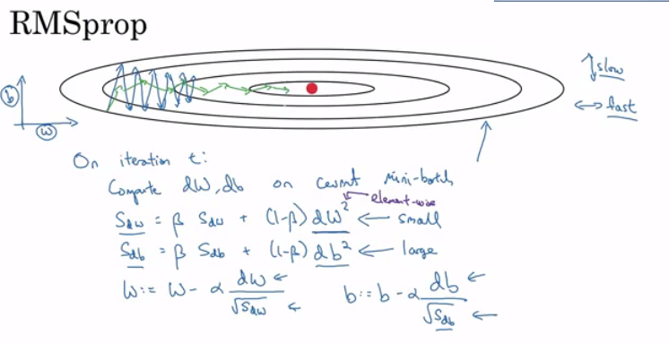

# Optimization algorithms

### Mini-batch gradient descent

- Training NN with a large data is slow. So to find an optimization algorithm that runs faster is a good idea.
- Suppose we have `m = 50 million.` To train this data it will take a huge processing time for one step.
  - because 50 million won't fit in the memory at once we need other processing to make such a thing.
- It turns out you can make a faster algorithm to make gradient decent process some of your items even before you finish the 50 million items.
- Suppose we have split m to **mini batches**.
  - `X{1} = 0    ==>  1000`
  - `X{2} = 1001 ==>  2000`
  - `....`
  - `X{bs} = ...`
- We similarly split `X` & `Y`.
- So the definition of mini batches ==> `t: X{t}, Y{t}`
- In **Batch gradient descent** We run the gradient decent on the whole dataset.
- While in **Mini-Batch gradient descent** We run the gradient decent on the mini datasets.
- Mini-Batch algorithm pseudo code:

  ```
  for t = 1:No_of_batches                                     #This is called on epoch
  	AL, caches = forward_prop(X{t}, Y{t})
  	Cost = compute_cost(AL, Y{t})
  	grads = backward_prop(AL, caches)
  	UpdateParameters(grads)
  ```

- The code inside an epoch should be vectorized.
- This works much faster in the large datasets.

### Understanding mini-batch gradient descent

- In mini batch algorithm, the cost won't go down with each step as batch algorithm do. It could contain some ups and downs but at whole it has to go down.
  - 
- Choosing mini-batch size
  - If (`mini batch size = m`)     ==>    Batch gradient descent
    - If (`mini batch size = 1`)  ==>    Stochastic gradient descent
    - Might be faster than standard in big data `> 10^7`
    - If (`mini batch size = between 1 and m`) ==>    Mini Batch gradient descent
- In Stochastic gradient descent is so noisy regarding cost minimization and won't reach the minimum cost. Also you lose vectorization advantage.
- In mini batch gradient descent is so noisy regarding cost minimization and won't reach the minimum cost. But you have the vectorization advantage and you can look at the costs when the code is running to see if its right. To help with the noisy cost minimization you should reduce the learning rate.
- Guidelines for using mini batch:
  - It has to be a power of 2 to take advantage of vectorization:
    `64, 128, 256, 512, 1024....`
  - Make sure mini-batch fits in CPU/GPU
- Mini batch size is a Hyperparameter.

### Exponentially weighted averages

- There are optimization algorithms that are better than **gradient descent**. but you should first learn about Exponentially weighted averages.
- If we have data like the temperature of day through the year it could be like this:

  ```
  t(1) = 40
  t(2) = 49
  t(3) = 45
  ..
  t(180) = 60
  ..
  ```

- This data is small in winter and big in summer. If we plot this data we will find it some noisy.
- Now lets compute the Exponentially weighted averages:

  ```
  V0 = 0
  V1 = 0.9 * V0 + 0.1 * t(1) = 4		# 0.9 and 0.1 are hyperparameters
  V2 = 0.9 * V1 + 0.1 * t(2) = 8.5
  V3 = 0.9 * V2 + 0.1 * t(3) = 12.15
  ...
  ```

- If we plot this it will represent averages.
- Another imagery example:
  - 
  - Taken from: [investopedia.com](investopedia.com)
- General equation

  ```
  V(t) = beta v(t-1) + (1-beta) ceta(t)
  ```

  - If `beta = 0.9` then we are averaging through this equation: `(1/ (1-beta))` Then
    - beta = 0.9 will average last 10 entries.
    - beta = 0.98 will average last 50 entries.
    - beta = 0.5 will average last 2 entries.
- Best beta average for our case is between 0.9 and 0.98

### Understanding exponentially weighted averages

- Intuitions:
  - 
- We can implement this algorithm with more accurate results if we make a moving window. But the code is more efficient and faster using the exponentially weighted averages algorithm.

- Algorithm is so simple:

  ```
  V = 0
  Repeat
  {
  	Get ceta(t)
  	V = beta * V + (1-beta) * ceta(t)
  }
  ```

### Bias correction in exponentially weighted averages

- The bias correction helps making the exponentially weighted averages more accurate.
- Because `V(0) = 0`, the bias of the weighted averages is shifted and the accuracy suffers.
- To solve the bias issue we have to use this equation:

  ```
  V(t) = (beta v(t-1) + (1-beta) ceta(t)) / (1 - beta^t)
  ```

- As you see the as t became larger the `(1 - beta^t)` became `1`

### Gradient descent with momentum

- The momentum algorithm works faster than standard Gradient descent.
- The simple idea is to calculate the exponentially weighted averages for your gradients and then updates your weights with the new values.
- Pseudo code:

  ```
  VdW = 0, Vdb = 0
  on iteration t:
  	# The mini batch can be the whole batch its ok
  	compute dw, db on current mini batch                
  			
  	VdW = (beta * VdW) + (1 - beta)dW
  	Vdb = (beta * Vdb) + (1 - beta)db
  	W = W - learning_rate * VdW
  	b = B - learning_rate * Vdb
  ```

- This will help the cost function to go to the minimum point in a more fast and consistent way.
- `beta = 0.9` is working very well for lots of people.
- In practice people don't bother with **Bias correction** (They leave the first iterations to work as they want)

### RMSprop

- Stands for **Root mean square prop**.
- This algorithm speeds up the Gradient descent.
- Pseudo code:

  ```
  SdW = 0, Sdb = 0
  on iteration t:
  	# The mini batch can be the whole batch its ok
  	compute dw, db on current mini batch
  	
  	SdW = (beta * SdW) + (1 - beta)dW^2
  	Sdb = (beta * Sdb) + (1 - beta)db^2
  	W = W - learning_rate * dW/sqrt(SdW)
  	b = B - learning_rate * db/sqrt(Sdb)
  ```

- This algorithm will make the cost function move on the vertical direction slow and the horizontal direction fast, in the following example.
  - 

- Ensure that `SdW` is not zero by adding a small value to it (epsilon).
   `W = W - learning_rate * dW/(sqrt(SdW) + epsilon)`

- With this algorithm you can increase your learning rate.
- Developed by Jeoffery Hinton on [Coursea.com](Coursea.com ).

### Adam optimization algorithm

- Stands for **Adaptive Momentum Estimation**.
- Adam optimization and RMSprop are among the optimization algorithms that worked very well with a lot of NN architectures.
- Adam optimization simply puts RMSprop and momentum and puts the together!
- Pseudo code:

  ```
  VdW = 0, VdW = 0
  SdW = 0, Sdb = 0
  on iteration t:
  	# The mini batch can be the whole batch its ok
  	compute dw, db on current mini batch                
  			
  	VdW = (beta1 * dW) + (1 - beta1)dW                    #Momentum
  	Vdb = (beta1 * db) + (1 - beta1)db					#Momentum
  			
  	SdW = (beta2 * dW) + (1 - beta2)dW^2					#RMSprop
  	Sdb = (beta2 * db) + (1 - beta2)db^2					#RMSprop
  			
  	VdW = VdW/ (1 - beta^t)			#Fixing bias
  	Vdb = Vdb/ (1 - beta^t)			#Fixing bias
  			
  	SdW = SdW/ (1 - beta^t) 		#Fixing bias
  	Sdb = Sdb/ (1 - beta^t)			#Fixing bias
  					
  	W = W - learning_rate * VdW/(sqrt(SdW) + epsilon)
  	b = B - learning_rate * Vdb/(sqrt(Sdb) + epsilon)
  ```

- Hyperparameters:
  - Learning rate: needed to be tuned.
  - `Beta1`. Parameter of the momentum. `0.9` is recommended by default.
  - `Beta2`. Parameter of the RMSprop. `0.999` is recommended by default.
  - `epsilon`. `10^-8` is recommended by default.

### Learning rate decay

- Slowly reduce learning rate.
- In mini batch algorithm, we said that the minimization of the cost won't reach optimum point. But by making the learning rate decays with iterations it will reach it as the steps beside the optimum is small.
- One technique equations is`learning_rate = (1 / (1 + decay_rate * epoch_num)) * learning_rate_0`  
  - `epoch_num` is over all data (not a single mini batch).
- Other learning rate decay methods (Continuous):
  - `learning_rate = (0.95 ^ epoch_num) * learning_rate_0`
  - `learning_rate = (k / sqrt(epoch_num)) * learning_rate_0`
- Some people is making changing the learning rate manually.
- For Andrew Ng, learning rate decay has less priority

### The problem of local optima

- The normal local optima is not likely to appear in a deep neural network.
- You are unlikely to get stuck in a bad local optima in high dimensions.
- Plateaus can make learning slow.
  - Plateaus is an area of fairly level high ground.
  - This is where algorithms like momentum and Adam helps.