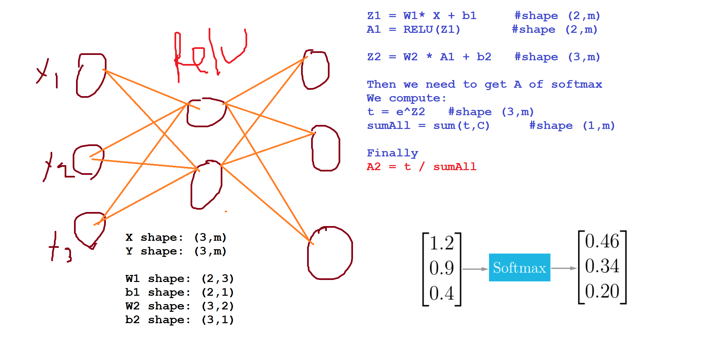

# Hyperparameter tuning, Batch Normalization and Programming Frameworks

### Tuning process

- We need some steps to tune our Hyperparameters to get the best out of them.
- So far the Hyperparameters importance are (As to Andrew Ng)
  1. Learning rate.
  2. Mini-batch size.
  3. No. of hidden units.
  4. Momentum beta.
  5. No. of layers.
  6. Use learning rate decay?
  7. Adam `beta1` & `beta2`
  8. regularization lambda
  9. Activation functions
- Its hard to decide which Hyperparameter is the more important in a problem. It depends much on your problem.
- One of the ideas to tune is to make a box with `N` Hyperparameter settings and then try the `N` settings on your problem.
- You can use Coarse to fine box and randomly initialize it the hyperparameters.
  - Then if you find some values that gives you a better values. Zoom into the box.
- This methods can be automated!

### Using an appropriate scale to pick hyperparameters

- If you have a specific range for a hyper parameter lets say from "a" to "b". Lets demonstrate the logarithmic scale, this will give you a good random points:
  - Calculate: `aLog = log(a)`                   `# Ex. a = 0.0001 then aLog = -4`
    - Calculate: `bLog = log(b)`                 `# Ex. b = 1  then bLog = 0`
  - Then: write this code:

    ```
    r = (aLog-bLog) * np.random.rand() + 	bLog
    # In our Ex the range would be from [-4, 0] because rand range [0,1)
    result = 10^r
    ```
It uniformly samples values from [a, b] as r.
- If we want to use the last method on exploring on the "momentum beta":
  - Beta best range is from 0.9 to 0.999
  - You should scale this to `1-Beta = 0.001 to 0.1` and the use `a = 0.001` and `b = 0.1`
  - And remember to subtract 1 from the resulted random value.

### Hyperparameters tuning in practice: Pandas vs. Caviar 

- If you don't have a much computational resources you will go thought "The baby sit model"
  - Run the model with different hyperparameters day by day.
  - Check at the end of each day if there are a progress or not.
  - You run one model at a time.
  - Called panda approach
- If you have computational resources, you can run some models in parallel and at the end of the day(s) you check the results.
  - Called Caviar model.

### Normalizing activations in a network

- In the current evolution of deep learning an algorithm called **Batch Normalization** is so important.
  - Made by Sergey Ioffe and Christian Szegedy.
- Batch Normalization speeds up learning.
- We discussed before that we can normalize input using the mean and variance method. This helped a lot in the shape of the cost function and reaching the minimum point in a more faster way!
- The question is *For any hidden layer can we normalize `A[l]` to train `W[l]`, `b[l]` faster?*. This is what batch normalization is about.
- Some papers normalize `Z[l]` and some normalize `A[l]`. Most of them uses `Z[l]` and recommended from Andrew Ng.
- Algorithm
  - Given `Z[l] = [z(1) z(2) .. z(m)]`   `#i = 1 to m (for one input)`
  - Compute `mean[i] = 1/m * sum(z[i])`
  - Compute `Variance[i] = 1/m * sum((z[i] - mean)^2)`
  - Then `Z_norm[i] = (z(i) - mean) / np.sqrt(Variance + epsilon)`
    - Forcing the outputs to a specific distribution.
  - Then `Z_dash[i] = alpha * Z_norm[i] + beta`
    - alpha and beta are learnable parameters.
    - Making the NN learn the distribution of the outputs.

### Fitting Batch Normalization into a neural network

- Using batch norm in 3 hidden layers NN:
  - 
- Our NN parameters will be:
  - `W[1]`, `b[1]`, `W[2]`, `b[2]`, `W[3]`, `b[3]`, `beta[1]`, `alpha[1]`, `beta[2]`, `alpha[2]`, `beta[3]`, `alpha[3]`
- If you are using a deep learning framework, You won't have to implement batch norm yourself.
  - Ex. in Tensorflow you can add this line: `tf.nn.batch-normalization()`
- If we are using batch norm the parameter `b[1]`, `b[2]`,.... Doesn't count because:
  - `Z[l] = W[l]A[l-1] + b[l]`
  - `Z_N[l] = alpha[l] * Z_norm[l] + beta[l]`
  - Taking the mean of a constant `b[l]` will eliminate the `b[l]`
- So if you are using batch normalization, you can remove b[l] or make it always zero.
- So the parameter will be Ws, betas, and alphas.
- Shapes:
  - `Z[l]`				`#(n[l], m)`
    - `alpha[l]`      	        `#(n[l], m)`
    - `beta[l]`                `#(n[l], m)`

### Why does Batch normalization work

- The first reason is the same reason as why we normalize X.
- The second reason is that batch normalization reduces the problem of input values changing.
- Batch norm does some regularization:
  - Each mini batch is scaled by the mean/variance computed of that mini batch.
  - -This adds some noise to the values `Z[l]` within that mini batch. Similar to dropout it adds some noise to each hidden layer activation
  - This has a slight regularization effect.
- To reduce this regularization effect you can make your mini batch bigger.
- If you need regularization you cant just rely on that slight regularization you'll need to add your regularization (L2 or dropout).

### Batch normalization at test time

- When we train a NN with Batch normalization, we compute the mean and the variance of the size of mini-batch.
- In testing we have to test one by one example. The mean and the variance of one example doesn't make sense!
- We have to compute an estimate value of mean and variance to use it in the testing time.
- We can use the weighted average across the mini batches.
- We will use the estimate values of the mean and variance to test.
- There are another method to estimate this value called "Running average"
- In practice don't worry as you will use a deep learning framework and it will contain some default of doing such a thing.

### Softmax Regression

- Every example we have used so far are talking about classification on only two classes.
- There are a generalization of logistic regression called Softmax regression that are more general.
- For example if we are classifying dogs, cat, and none of that
  - Dog `class = 1`
  - Cat `class = 2`
  - None `class = 0`
  - To represent a dog vector `y = [1 0 0]`
  - To represent a cat vector `y = [0 1 0]`
  - To represent a none vector `y = [0 0 1]`
- We will use these notations:
  - `C = no. Of classes`
  - Range of classes is `(0,...C-1)`
  - In output layer. `Ny = C`
- Each of the output layers will contain a probability if the class is true.
- In the last layer we will have to activate the Softmax activation function instead of the sigmoid activation.
- Softmax activation equations:

  ```
  t = e^(Z[L])        # shape(C, m)
  A[L] = e^(Z[L]) / sum(t, C)       # shape(C, m)
  ```

### Training a Softmax classifier

- There's an activation which is called hard max, which gets 1 for the maximum value and zeros for the others.
  - If you are using NumPy, its `np.max` over the vertical axis.
- The Softmax name came from Softening the values and not harding them like hard max.
- Softmax is a generalization of logistic regression with two or more classes.
- The loss function used with Softmax:

  ```
  L(y,y_dash) = -sum(y[i]*log(y_dash), C)
  ```

- The cost function used with Softmax:

  ```
  J(w[1], b[1], ....) = -1/m * (sum(L(y[i],y_dash[i]), m))
  ```

- Back propagation with Softmax:

  ```
  dZ[L] = Y_dash - Y
  ```

- The derivative of Softmax is:

  ```
  Y_dash( 1 - Y_dash)
  ```

- Example:
  - 


