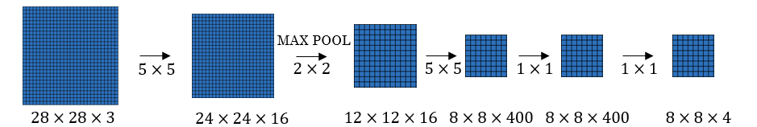
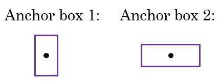
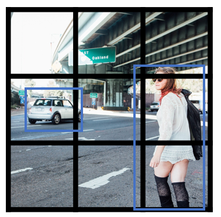

# Object detection

> Learn how to apply your knowledge of CNNs to one of the toughest but hottest field of computer vision: Object detection.

### Object Localization

- Object detection is one of the areas in which deep learning is doing great in the past two years.

- What are localization and detection?

  - **Image Classification**: 
    - Classify an image to a specific class. The whole image represents one class. We don't want to know exactly where are the object. Usually only one object is presented.
    - 
  - **Classification with localization**:
    - Given an image we want to learn the class of the image and where are the class location in the image. We need to detect a class and a rectangle of where that object is. Usually only one object is presented.
    - 
  - **Object detection**:
    - Given an image we want to detect all the object in the image that belong to a specific classes and give their location. An image can contain more than one object with different classes.
    - 
  - **Semantic Segmentation**:
    - We want to Label each pixel in the image with a category label. Semantic Segmentation Don't differentiate instances, only care about pixels. It detects no objects just pixels.
    - If there are two objects of the same class is intersected, we won't be able to separate them.
    - 
  - **Instance Segmentation**
    - This is like the full problem. Rather than we want to predict the bounding box, we want to know which pixel label but also distinguish them.
    - 

- To make image classification we use a Conv Net with a Softmax attached to the end of it.

- To make classification with localization we use a Conv Net with a softmax attached to the end of it and a four numbers `bx`, `by`, `bh`, and `bw` to tell you the location of the class in the image. The dataset should contain this four numbers with the class too.

- Defining the target label Y in classification with localization problem: 

  - ```
    Y = [
      		Pc				# Probability of an object is presented
      		bx				# Bounding box
      		by				# Bounding box
      		bh				# Bounding box
      		bw				# Bounding box
      		c1				# The classes
      		c2
      		...
    ]
    ```

  - Example (Object is present):

    - ```
      Y = [
        		1		# Object is present
        		0
        		0
        		100
        		100
        		0
        		1
        		0
      ]
      ```

  - Example (When object isn't presented):

    - ```
      Y = [
        		0		# Object isn't presented
        		?		# ? means we dont care with other values
        		?
        		?
        		?
        		?
        		?
        		?
      ]
      ```

- The loss function for the Y we have created (Example of the square error):

  - ```
    L(y',y) = {
      			(y1'-y1)^2 + (y2'-y2)^2 + ...           if y1 = 1
      			(y1'-y1)^2						if y1 = 0
    		}
    ```

  - In practice we use logistic regression for `pc`, log likely hood loss for classes, and squared error for the bounding box.

### Landmark Detection

- In some of the computer vision problems you will need to output some points. That is called **landmark detection**.

- For example, if you are working in a face recognition problem you might want some points on the face like corners of the eyes, corners of the mouth, and corners of the nose and so on. This can help in a lot of application like detecting the pose of the face.

- Y shape for the face recognition problem that needs to output 64 landmarks:

  - ```
    Y = [
      		THereIsAface				# Probability of face is presented 0 or 1
      		l1x,
      		l1y,
      		....,
      		l64x,
      		l64y
    ]
    ```

- Another application is when you need to get the skeleton of the person using different landmarks/points in the person which helps in some applications.

- Hint, in your labeled data, if `l1x,l1y` is the left corner of left eye, all other `l1x,l1y` of the other examples has to be the same.

### Object Detection

- We will use a Conv net to solve the object detection problem using a technique called the sliding windows detection algorithm.
- For example lets say we are working on Car object detection.
- The first thing, we will train a Conv net on cropped car images and non car images.
  - 
- After we finish training of this Conv net we will then use it with the sliding windows technique.
- Sliding windows detection algorithm:
  1. Decide a rectangle size.
  2. Split your image into rectangles of the size you picked. Each region should be covered. You can use some strides.
  3. For each rectangle feed the image into the Conv net and decide if its a car or not.
  4. Pick larger/smaller rectangles and repeat the process from 2 to 3.
  5. Store the rectangles that contains the cars.
  6. If two or more rectangles intersects choose the rectangle with the best accuracy.
- Disadvantage of sliding window is the computation time.
- In the era of machine learning before deep learning, people used a hand crafted linear classifiers that classifies the object and then use the sliding window technique. The linear classier make it a cheap computation. But in the deep learning era that is so  computational expensive due to the complexity of the deep learning model.
- To solve this problem, we can implement the sliding windows with a ***Convolutional approach***.
- One other idea is to compress your deep learning model.

### Convolutional Implementation of Sliding Windows

- Turning FC layer into convolutional layers (predict image class from four classes):
  - 
  - As you can see in the above image, we turned the FC layer into a Conv layer using a convolution with the width and height of the filter is the same as the width and height of the input.
- **Convolution implementation of sliding windows**:
  - First lets consider that the Conv net you trained is like this (No FC all is conv layers):
    - 
  - Say now we have a 16 x 16 x 3 image that we need to apply the sliding windows in. By the normal implementation that have been mentioned in the section before this, we would run this Conv net four times each rectangle size will be 16 x 16.
  - The convolution implementation will be as follows:
    - 
  - Simply we have feed the image into the same Conv net we have trained.
  - The left cell of the result "The blue one" will represent the the first sliding window of the normal implementation. The other cells will represent the others.
  - Its more efficient because it now shares the computations of the four times needed.
  - Another example would be:
    - 
  - This example has a total of 16 sliding windows that shares the computation together.
  - [[Sermanet et al., 2014, OverFeat: Integrated recognition, localization and detection using convolutional networks]](https://arxiv.org/abs/1312.6229)
- The weakness of the algorithm is that the position of the rectangle wont be so accurate. Maybe none of the rectangles is exactly on the object you want to recognize.
  - 
  - In red, the rectangle we want and in blue is the required car rectangle.

### Bounding Box Predictions

- A better algorithm than the one described in the last section is the [YOLO algorithm](https://arxiv.org/abs/1506.02640).

- YOLO stands for *you only look once* and was developed back in 2015.

- Yolo Algorithm:

  - 

  1. Lets say we have an image of 100 X 100
  2. Place a  3 x 3 grid on the image. For more smother results you should use 19 x 19 for the 100 x 100
  3. Apply the classification and localization algorithm we discussed in a previous section to each section of the grid. `bx` and `by` will represent the center point of the object in each grid and will be relative to the box so the range is between 0 and 1 while `bh` and `bw` will represent the height and width of the object which can be greater than 1.0 but still a floating point value.
  4. Do everything at once with the convolution sliding window. If Y shape is 1 x 8 as we discussed before then the output of the 100 x 100 image should be 3 x 3 x 8 which corresponds to 9 cell results.
  5. Merging the results using predicted localization mid point.

- We have a problem if we have found more than one object in one grid box.

- One of the best advantages that makes the YOLO algorithm popular is that it has a great speed and a Conv net implementation.

- How is YOLO different from other Object detectors?  YOLO uses a single CNN
  network for both classification and localizing the object using bounding boxes.

- In the next sections we will see some ideas that can make the YOLO algorithm better.

### Intersection Over Union

- Intersection Over Union is a function used to evaluate the object detection algorithm.
- It computes size of intersection and divide it by the union. More generally, *IoU* *is a measure of the overlap between two bounding boxes*.
- For example:
  - 
  - The red is the labeled output and the purple is the predicted output.
  - To compute Intersection Over Union we first compute the union area of the two rectangles which is "the first rectangle + second rectangle" Then compute the intersection area between these two rectangles.
  - Finally `IOU = intersection area / Union area`
- If `IOU >=0.5` then its good. The best answer will be 1.
- The higher the IOU the better is the accuracy.

### Non-max Suppression

- One of the problems we have addressed in YOLO is that it can detect an object multiple times.
- Non-max Suppression is a way to make sure that YOLO detects the object just once.
- For example:
  - 
  - Each car has two or more detections with different probabilities. This came from some of the grids that thinks that this is the center point of the object.
- Non-max suppression algorithm:
  1. Lets assume that we are targeting one class as an output class.
  2. Y shape should be `[Pc, bx, by, bh, hw]` Where Pc is the probability if that object occurs.
  3. Discard all boxes with `Pc < 0.6`  
  4. While there are any remaining boxes:
     1. Pick the box with the largest Pc Output that as a prediction.
     2. Discard any remaining box with `IoU > 0.5` with that box output in the previous step i.e any box with high overlap(greater than overlap threshold of 0.5).
- If there are multiple classes/object types `c` you want to detect, you should run the Non-max suppression `c` times, once for every output class.

### Anchor Boxes

- In YOLO, a grid only detects one object. What if a grid cell wants to detect multiple object?
  - 
  - Car and person grid is same here.
  - In practice this happens rarely.
- The idea of Anchor boxes helps us solving this issue.
- If Y = `[Pc, bx, by, bh, bw, c1, c2, c3]` Then to use two anchor boxes like this:
  - Y = `[Pc, bx, by, bh, bw, c1, c2, c3, Pc, bx, by, bh, bw, c1, c2, c3]`  We simply have repeated  the one anchor Y.
  - The two anchor boxes you choose should be known as a shape:
    - 
- So Previously, each object in training image is assigned to grid cell that contains that object's midpoint.
- With two anchor boxes, Each object in training image is assigned to grid cell that contains object's midpoint and anchor box for the grid cell with <u>highest IoU</u>. You have to check where your object should be based on its rectangle closest to which anchor box.
- Example of data:
  - 
  - Where the car was near the anchor 2 than anchor 1.
- You may have two or more anchor boxes but you should know their shapes.
  - how do you choose the anchor boxes and people used to just choose them by hand. Maybe five or ten anchor box shapes that spans a variety  of shapes that cover the types of objects you seem to detect frequently.
  - You may also use a k-means algorithm on your dataset to specify that.
- Anchor boxes allows your algorithm to specialize, means in our case to easily detect wider images or taller ones.

### YOLO Algorithm

- YOLO is a state-of-the-art object detection model that is fast and accurate

- Lets sum up and introduce the whole YOLO algorithm given an example.

- Suppose we need to do object detection for our autonomous driver system.It needs to identify three classes:

  1. Pedestrian (Walks on ground).
  2. Car.
  3. Motorcycle.

- We decided to choose two anchor boxes, a taller one and a wide one.

  - Like we said in practice they use five or more anchor boxes hand made or generated using k-means.

- Our labeled Y shape will be `[Ny, HeightOfGrid, WidthOfGrid, 16]`, where Ny is number of instances and each row (of size 16) is as follows:

  - `[Pc, bx, by, bh, bw, c1, c2, c3, Pc, bx, by, bh, bw, c1, c2, c3]`

- Your dataset could be an image with a multiple labels and a rectangle for each label, we should go to your dataset and make the shape and values of Y like we agreed.

  - An example:
    - 
  - We first initialize all of them to zeros and ?, then for each label and rectangle choose its closest grid point then the shape to fill it and then the best anchor point based on the IOU. so that the shape of Y for one image should be `[HeightOfGrid, WidthOfGrid,16]`

- Train the labeled images on a Conv net. you should receive an output of `[HeightOfGrid, WidthOfGrid,16]` for our case.

- To make predictions, run the Conv net on an image and run Non-max suppression algorithm for each class you have in our case there are 3 classes.

  - You could get something like that:
    - 
    - Total number of generated boxes are grid_width * grid_height * no_of_anchors = 3 x 3 x 2
  - By removing the low probability predictions you should have:
    - 
  - Then get the best probability followed by the IOU filtering:
    - 

- YOLO are not good at detecting smaller object.

- [YOLO9000 Better, faster, stronger](https://arxiv.org/abs/1612.08242)

  - Summary:

  - ```
    ________________________________________________________________________________________
    Layer (type)                     Output Shape          Param #     Connected to                
    ========================================================================================
    input_1 (InputLayer)             (None, 608, 608, 3)   0                                 
    ________________________________________________________________________________________
    conv2d_1 (Conv2D)                (None, 608, 608, 32)  864         input_1[0][0]         
    ________________________________________________________________________________________
    batch_normalization_1 (BatchNorm (None, 608, 608, 32)  128         conv2d_1[0][0]       
    ________________________________________________________________________________________
    leaky_re_lu_1 (LeakyReLU)        (None, 608, 608, 32)  0     batch_normalization_1[0][0] 
    ________________________________________________________________________________________
    max_pooling2d_1 (MaxPooling2D)   (None, 304, 304, 32)  0           leaky_re_lu_1[0][0]   
    ________________________________________________________________________________________
    conv2d_2 (Conv2D)                (None, 304, 304, 64)  18432       max_pooling2d_1[0][0] 
    ________________________________________________________________________________________
    batch_normalization_2 (BatchNorm (None, 304, 304, 64)  256         conv2d_2[0][0]       
    ________________________________________________________________________________________
    leaky_re_lu_2 (LeakyReLU)        (None, 304, 304, 64)  0     batch_normalization_2[0][0] 
    _______________________________________________________________________________________
    max_pooling2d_2 (MaxPooling2D)   (None, 152, 152, 64)  0           leaky_re_lu_2[0][0]   
    ________________________________________________________________________________________
    conv2d_3 (Conv2D)                (None, 152, 152, 128) 73728       max_pooling2d_2[0][0] 
    ________________________________________________________________________________________
    batch_normalization_3 (BatchNorm (None, 152, 152, 128) 512         conv2d_3[0][0]       
    ________________________________________________________________________________________
    leaky_re_lu_3 (LeakyReLU)        (None, 152, 152, 128) 0     batch_normalization_3[0][0] 
    ________________________________________________________________________________________
    conv2d_4 (Conv2D)                (None, 152, 152, 64)  8192        leaky_re_lu_3[0][0]   
    ________________________________________________________________________________________
    batch_normalization_4 (BatchNorm (None, 152, 152, 64)  256         conv2d_4[0][0]       
    ________________________________________________________________________________________
    leaky_re_lu_4 (LeakyReLU)        (None, 152, 152, 64)  0     batch_normalization_4[0][0] 
    ________________________________________________________________________________________
    conv2d_5 (Conv2D)                (None, 152, 152, 128) 73728       leaky_re_lu_4[0][0]   
    ________________________________________________________________________________________
    batch_normalization_5 (BatchNorm (None, 152, 152, 128) 512         conv2d_5[0][0]       
    ________________________________________________________________________________________
    leaky_re_lu_5 (LeakyReLU)        (None, 152, 152, 128) 0     batch_normalization_5[0][0] 
    ________________________________________________________________________________________
    max_pooling2d_3 (MaxPooling2D)   (None, 76, 76, 128)   0           leaky_re_lu_5[0][0]   
    ________________________________________________________________________________________
    conv2d_6 (Conv2D)                (None, 76, 76, 256)   294912      max_pooling2d_3[0][0] 
    _______________________________________________________________________________________
    batch_normalization_6 (BatchNorm (None, 76, 76, 256)   1024        conv2d_6[0][0]       
    ________________________________________________________________________________________
    leaky_re_lu_6 (LeakyReLU)        (None, 76, 76, 256)   0     batch_normalization_6[0][0] 
    _______________________________________________________________________________________
    conv2d_7 (Conv2D)                (None, 76, 76, 128)   32768       leaky_re_lu_6[0][0]   
    ________________________________________________________________________________________
    batch_normalization_7 (BatchNorm (None, 76, 76, 128)   512         conv2d_7[0][0]       
    _______________________________________________________________________________________
    leaky_re_lu_7 (LeakyReLU)        (None, 76, 76, 128)   0     batch_normalization_7[0][0] 
    ________________________________________________________________________________________
    conv2d_8 (Conv2D)                (None, 76, 76, 256)   294912      leaky_re_lu_7[0][0]   
    ________________________________________________________________________________________
    batch_normalization_8 (BatchNorm (None, 76, 76, 256)   1024        conv2d_8[0][0]       
    ________________________________________________________________________________________
    leaky_re_lu_8 (LeakyReLU)        (None, 76, 76, 256)   0     batch_normalization_8[0][0] 
    ________________________________________________________________________________________
    max_pooling2d_4 (MaxPooling2D)   (None, 38, 38, 256)   0           leaky_re_lu_8[0][0]   
    ________________________________________________________________________________________
    conv2d_9 (Conv2D)                (None, 38, 38, 512)   1179648     max_pooling2d_4[0][0] 
    ________________________________________________________________________________________
    batch_normalization_9 (BatchNorm (None, 38, 38, 512)   2048        conv2d_9[0][0]       
    ________________________________________________________________________________________
    leaky_re_lu_9 (LeakyReLU)        (None, 38, 38, 512)   0     batch_normalization_9[0][0] 
    ________________________________________________________________________________________
    conv2d_10 (Conv2D)               (None, 38, 38, 256)   131072      leaky_re_lu_9[0][0]   
    ________________________________________________________________________________________
    batch_normalization_10 (BatchNor (None, 38, 38, 256)   1024        conv2d_10[0][0]       
    ________________________________________________________________________________________
    leaky_re_lu_10 (LeakyReLU)       (None, 38, 38, 256)   0    batch_normalization_10[0][0]
    ________________________________________________________________________________________
    conv2d_11 (Conv2D)               (None, 38, 38, 512)   1179648    leaky_re_lu_10[0][0]   
    ________________________________________________________________________________________
    batch_normalization_11 (BatchNor (None, 38, 38, 512)   2048        conv2d_11[0][0]       
    ________________________________________________________________________________________
    leaky_re_lu_11 (LeakyReLU)       (None, 38, 38, 512)   0    batch_normalization_11[0][0]
    _______________________________________________________________________________________
    conv2d_12 (Conv2D)               (None, 38, 38, 256)   131072      leaky_re_lu_11[0][0] 
    ________________________________________________________________________________________
    batch_normalization_12 (BatchNor (None, 38, 38, 256)   1024        conv2d_12[0][0]       
    ________________________________________________________________________________________
    leaky_re_lu_12 (LeakyReLU)       (None, 38, 38, 256)   0   batch_normalization_12[0][0]
    ________________________________________________________________________________________
    conv2d_13 (Conv2D)               (None, 38, 38, 512)   1179648     leaky_re_lu_12[0][0] 
    ________________________________________________________________________________________
    batch_normalization_13 (BatchNor (None, 38, 38, 512)   2048        conv2d_13[0][0]       
    ________________________________________________________________________________________
    leaky_re_lu_13 (LeakyReLU)       (None, 38, 38, 512)   0    batch_normalization_13[0][0]
    ________________________________________________________________________________________
    max_pooling2d_5 (MaxPooling2D)   (None, 19, 19, 512)   0           leaky_re_lu_13[0][0] 
    _______________________________________________________________________________________
    conv2d_14 (Conv2D)               (None, 19, 19, 1024)  4718592     max_pooling2d_5[0][0] 
    ________________________________________________________________________________________
    batch_normalization_14 (BatchNor (None, 19, 19, 1024)  4096        conv2d_14[0][0]       
    ________________________________________________________________________________________
    leaky_re_lu_14 (LeakyReLU)       (None, 19, 19, 1024)  0    batch_normalization_14[0][0]
    ________________________________________________________________________________________
    conv2d_15 (Conv2D)               (None, 19, 19, 512)   524288      leaky_re_lu_14[0][0] 
    ________________________________________________________________________________________
    batch_normalization_15 (BatchNor (None, 19, 19, 512)   2048        conv2d_15[0][0]       
    ________________________________________________________________________________________
    leaky_re_lu_15 (LeakyReLU)       (None, 19, 19, 512)   0    batch_normalization_15[0][0]
    ________________________________________________________________________________________
    conv2d_16 (Conv2D)               (None, 19, 19, 1024)  4718592     leaky_re_lu_15[0][0] 
    ________________________________________________________________________________________
    batch_normalization_16 (BatchNor (None, 19, 19, 1024)  4096        conv2d_16[0][0]       
    ________________________________________________________________________________________
    leaky_re_lu_16 (LeakyReLU)       (None, 19, 19, 1024)  0    batch_normalization_16[0][0]
    ________________________________________________________________________________________
    conv2d_17 (Conv2D)               (None, 19, 19, 512)   524288      leaky_re_lu_16[0][0] 
    ________________________________________________________________________________________
    batch_normalization_17 (BatchNor (None, 19, 19, 512)   2048        conv2d_17[0][0]       
    ________________________________________________________________________________________
    leaky_re_lu_17 (LeakyReLU)       (None, 19, 19, 512)   0    batch_normalization_17[0][0]
    _______________________________________________________________________________________
    conv2d_18 (Conv2D)               (None, 19, 19, 1024)  4718592     leaky_re_lu_17[0][0] 
    ________________________________________________________________________________________
    batch_normalization_18 (BatchNor (None, 19, 19, 1024)  4096        conv2d_18[0][0]       
    ________________________________________________________________________________________
    leaky_re_lu_18 (LeakyReLU)       (None, 19, 19, 1024)  0    batch_normalization_18[0][0]
    ________________________________________________________________________________________
    conv2d_19 (Conv2D)               (None, 19, 19, 1024)  9437184     leaky_re_lu_18[0][0] 
    ________________________________________________________________________________________
    batch_normalization_19 (BatchNor (None, 19, 19, 1024)  4096        conv2d_19[0][0]       
    ________________________________________________________________________________________
    conv2d_21 (Conv2D)               (None, 38, 38, 64)    32768       leaky_re_lu_13[0][0]
    ________________________________________________________________________________________
    leaky_re_lu_19 (LeakyReLU)       (None, 19, 19, 1024)  0    batch_normalization_19[0][0]
    ________________________________________________________________________________________
    batch_normalization_21 (BatchNor (None, 38, 38, 64)    256         conv2d_21[0][0]       
    ________________________________________________________________________________________
    conv2d_20 (Conv2D)               (None, 19, 19, 1024)  9437184     leaky_re_lu_19[0][0]
    ________________________________________________________________________________________
    leaky_re_lu_21 (LeakyReLU)       (None, 38, 38, 64)    0    batch_normalization_21[0][0]
    ________________________________________________________________________________________
    batch_normalization_20 (BatchNor (None, 19, 19, 1024)  4096        conv2d_20[0][0]       
    ________________________________________________________________________________________
    space_to_depth_x2 (Lambda)       (None, 19, 19, 256)   0           leaky_re_lu_21[0][0] 
    ________________________________________________________________________________________
    leaky_re_lu_20 (LeakyReLU)       (None, 19, 19, 1024)  0    batch_normalization_20[0][0]
    ________________________________________________________________________________________
    concatenate_1 (Concatenate)      (None, 19, 19, 1280)  0         space_to_depth_x2[0][0] 
                                                                      leaky_re_lu_20[0][0] 
    ________________________________________________________________________________________
    conv2d_22 (Conv2D)               (None, 19, 19, 1024)  11796480    concatenate_1[0][0]   
    ________________________________________________________________________________________
    batch_normalization_22 (BatchNor (None, 19, 19, 1024)  4096        conv2d_22[0][0]       
    ________________________________________________________________________________________
    leaky_re_lu_22 (LeakyReLU)       (None, 19, 19, 1024)  0    batch_normalization_22[0][0]
    ________________________________________________________________________________________
    conv2d_23 (Conv2D)               (None, 19, 19, 425)   435625      leaky_re_lu_22[0][0] 
    ===============================================================================================
    Total params: 50,983,561
    Trainable params: 50,962,889
    Non-trainable params: 20,672
    _______________________________________________________________________________________________
    ```

- You can find implementations for YOLO here:

  - https://github.com/allanzelener/YAD2K
  - https://github.com/thtrieu/darkflow
  - https://pjreddie.com/darknet/yolo/

### Region Proposals (R-CNN)

- R-CNN is an algorithm that also makes an object detection.

- Yolo tells that its faster:

  - > Our model has several advantages over classifier-based systems. It looks at the whole image at test time so its predictions are informed by global context in the image. It also makes predictions with a single network evaluation unlike systems like R-CNN which require thousands for a single image. This makes it extremely fast, more than 1000x faster than R-CNN and 100x faster than Fast R-CNN. See our paper for more details on the full system.

- But one of the downsides of YOLO that it process a lot of areas where no objects are present.

- **R-CNN** stands for regions with Conv Nets.

- R-CNN tries to pick a few windows and run a Conv net (your confident classifier) on top of them.

- The algorithm R-CNN uses to pick windows is called a segmentation algorithm. Outputs something like this:

  - 

- If for example the segmentation algorithm produces 2000 blob then we should run our classifier/CNN on top of these blobs.

- There has been a lot of work regarding R-CNN tries to make it faster:

  - R-CNN:
    - Propose regions. Classify proposed regions one at a time. Output label + bounding box.
    - Downside is that its slow.
    - [[Girshik et. al, 2013. Rich feature hierarchies for accurate object detection and semantic segmentation]](https://arxiv.org/abs/1311.2524)
  - Fast R-CNN:
    - Propose regions. Use convolution implementation of sliding windows to classify all the proposed regions.
    - [[Girshik, 2015. Fast R-CNN]](https://arxiv.org/abs/1504.08083)
  - Faster R-CNN:
    - Use convolutional network to propose regions.
    - [[Ren et. al, 2016. Faster R-CNN: Towards real-time object detection with region proposal networks]](https://arxiv.org/abs/1506.01497)
  - Mask R-CNN:
    - https://arxiv.org/abs/1703.06870

- Most of the implementation of faster R-CNN are still slower than YOLO.

- Andew Ng thinks that the idea behind YOLO is better than R-CNN because you are able to do all the things in just one time instead of two times.

- Other algorithms that uses one shot to get the output includes **SSD** and **MultiBox**.

  - [[Wei Liu, et. al 2015 SSD: Single Shot MultiBox Detector]](https://arxiv.org/abs/1512.02325)

- **R-FCN** is similar to Faster R-CNN but more efficient.

  - [[Jifeng Dai, et. al 2016 R-FCN: Object Detection via Region-based Fully Convolutional Networks ]](https://arxiv.org/abs/1605.06409)