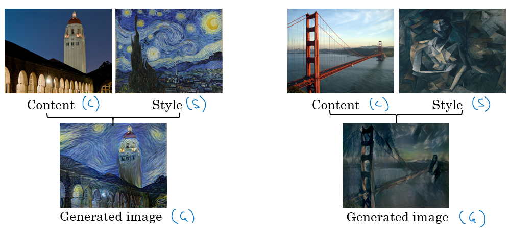
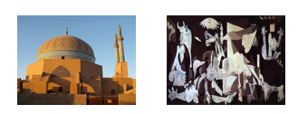

# Special applications: Face recognition & Neural style transfer

> Discover how CNNs can be applied to multiple fields, including art generation and face recognition. Implement your own algorithm to generate art and recognize faces!

### Face Recognition

#### What is face recognition?

- Face recognition system identifies a person's face. It can work on both images or videos.
- **<u>Liveness detection</u>** within a video face recognition system prevents the network from identifying a face in an image. It can be learned by supervised deep learning using a dataset for live human and in-live human and sequence learning.
- Face verification vs. face recognition:
  - Verification:
    - Input: image, name/ID. (1 : 1)
    - Output: whether the input image is that of the claimed person.
    - "is this the claimed person?"
  - Recognition:
    - Has a database of K persons
    - Get an input image
    - Output ID if the image is any of the K persons (or not recognized)
    - "who is this person?"
- We can use a face verification system to make a face recognition system. The accuracy of the verification system has to be high (around 99.9% or more) to be use accurately within a recognition system because the recognition system accuracy will be less than the verification system given K persons. 

#### One Shot Learning

- One of the face recognition challenges is to solve one shot learning problem.
- One Shot Learning: A recognition system is able to recognize a person, learning from one image.
- Historically deep learning doesn't work well with a small number of data.
- Instead to make this work, we will learn a **similarity function**:
  - d( **img1**, **img2** ) = degree of difference between images.
  - We want d result to be low in case of the same faces.
  - We use tau T as a threshold for d:
    - If d( **img1**, **img2** ) <= T    Then the faces are the same.
- Similarity function helps us solving the one shot learning. Also its robust to new inputs.

#### Siamese Network

- We will implement the similarity function using a type of NNs called Siamease Network in which we can pass multiple inputs to the two or more networks with the same architecture and parameters.
- Siamese network architecture are as the following:
  - 
  - We make 2 identical conv nets which encodes an input image into a vector. In the above image the vector shape is (128, )
  - The loss function will be `d(x1, x2) = || f(x1) - f(x2) ||^2`
  - If `X1`, `X2` are the same person, we want d to be low. If they are different persons, we want d to be high.
  - [[Taigman et. al., 2014. DeepFace closing the gap to human level performance]](https://www.cv-foundation.org/openaccess/content_cvpr_2014/html/Taigman_DeepFace_Closing_the_2014_CVPR_paper.html)

#### Triplet Loss

- Triplet Loss is one of the loss functions we can use to solve the similarity distance in a Siamese network.
- Our learning objective in the triplet loss function is to get the distance between an **Anchor** image and a **positive** or a **negative** image.
  - Positive means same person, while negative means different person.
- The triplet name came from that we are comparing an anchor A with a positive P and a negative N image.
- Formally we want:
  - Positive distance to be less than negative distance
  - `||f(A) - f(P)||^2  <= ||f(A) - f(N)||^2`
  - Then
  - `||f(A) - f(P)||^2  - ||f(A) - f(N)||^2 <= 0`
  - To make sure the NN won't get an output of zeros easily:
  - `||f(A) - f(P)||^2  - ||f(A) - f(N)||^2 <= -alpha`
    - Alpha is a small number. Sometimes its called the margin.
  - Then
  - `||f(A) - f(P)||^2  - ||f(A) - f(N)||^2 + alpha <= 0`
- Final Loss function:
  - Given 3 images (A, P, N)
  - `L(A, P, N) = max (||f(A) - f(P)||^2  - ||f(A) - f(N)||^2 + alpha , 0)`
  - `J = Sum(L(A[i], P[i], N[i]) , i)` for all triplets of images.
- You need multiple images of the same person in your dataset. Then get some triplets out of your dataset. Dataset should be big enough.
- Choosing the triplets A, P, N:
  - During training if A, P, N are chosen randomly (Subjet to A and P are the same and A and N aren't the same) then one of the problems this constrain is easily satisfied 
    - `d(A, P) + alpha <= d (A, N)` 
    - So the NN wont learn much
  - What we want to do is choose triplets that are **hard** to train on.
    - So for all the triplets we want this to be satisfied:
    - `d(A, P) + alpha <= d (A, N)`
    - This can be achieved by for example same poses!
    - Find more at the paper.
- Details are in this paper [[Schroff et al.,2015, FaceNet: A unified embedding for face recognition and clustering]](https://arxiv.org/abs/1503.03832)
- Commercial recognition systems are trained on a large datasets like 10/100 million images.
- There are a lot of pretrained models and parameters online for face recognition.

#### Face Verification and Binary Classification

- Triplet loss is one way to learn the parameters of a conv net for face recognition there's another way to learn these parameters as a straight binary classification problem.
- Learning the similarity function another way:
  - 
  - The final layer is a sigmoid layer.
  - `Y' = wi * Sigmoid ( f(x(i)) - f(x(j)) ) + b` where the subtraction is the Manhattan distance between f(x(i)) and f(x(j))
  - Some other similarities can be Euclidean and Ki square similarity.
  - The NN here is Siamese means the top and bottom convs has the same parameters.
- The paper for this work: [[Taigman et. al., 2014. DeepFace closing the gap to human level performance]](https://www.cv-foundation.org/openaccess/content_cvpr_2014/html/Taigman_DeepFace_Closing_the_2014_CVPR_paper.html)
- A good performance/deployment trick:
  - Pre-compute all the images that you are using as a comparison to the vector f(x(j))
  - When a new image that needs to be compared, get its vector f(x(i)) then put it with all the pre computed vectors and pass it to the sigmoid function.
- This version works quite as well as the triplet loss function.
- Available implementations for face recognition using deep learning includes:
  - [Openface](https://cmusatyalab.github.io/openface/)
  - [FaceNet](https://github.com/davidsandberg/facenet)
  - [DeepFace](https://github.com/RiweiChen/DeepFace)

### Neural Style Transfer

#### What is neural style transfer?

- Neural style transfer is one of the application of Conv nets.
- Neural style transfer takes a content image `C` and a style image `S` and generates the content image `G` with the style of style image.
- 
- In order to implement this you need to look at the features extracted by the Conv net at the shallower and deeper layers.
- It uses a previously trained convolutional network like VGG, and builds on top of that. The idea of using a network trained on a different task and applying it to a new task is called transfer learning.

#### What are deep ConvNets learning?

- Visualizing what a deep network is learning:
  - Given this AlexNet like Conv net:
    - 
  - Pick a unit in layer l. Find the nine image patches that maximize the unit's activation. 
    - Notice that a hidden unit in layer one will see relatively small portion of NN, so if you plotted it it will match a small image in the shallower layers while it will get larger image in deeper layers.
  - Repeat for other units and layers.
  - It turns out that layer 1 are learning the low level representations like colors and edges.
- You will find out that each layer are learning more complex representations.
  - 
- The first layer was created using the weights of the first layer. Other images are generated using the receptive field in the image that triggered the neuron to be max.
- [[Zeiler and Fergus., 2013, Visualizing and understanding convolutional networks]](https://arxiv.org/abs/1311.2901)
- A good explanation on how to get **receptive field** given a layer:
  - 
  - From [A guide to receptive field arithmetic for Convolutional Neural Networks](https://medium.com/@nikasa1889/a-guide-to-receptive-field-arithmetic-for-convolutional-neural-networks-e0f514068807)

#### Cost Function

- We will define a cost function for the generated image that measures how good it is.
- Give a content image C, a style image S, and a generated image G:
  - `J(G) = alpha * J(C,G) + beta * J(S,G)`
  - `J(C, G)` measures how similar is the generated image to the Content image.
  - `J(S, G)` measures how similar is the generated image to the Style image.
  - alpha and beta are relative weighting to the similarity and these are hyperparameters.
- Find the generated image G:
  1. Initiate G randomly
     - For example G: 100 X 100 X 3
  2. Use gradient descent to minimize `J(G)`
     - `G = G - dG`  We compute the gradient image and use gradient decent to minimize the cost function.
- The iterations might be as following image:
  - To Generate this:
    - 
  - You will go through this:
    - 

#### Content Cost Function

- In the previous section we showed that we need a cost function for the content image and the style image to measure how similar is them to each other.
- Say you use hidden layer `l` to compute content cost. 
  - If we choose `l` to be small (like layer 1), we will force the network to get similar output to the original content image.
  - In practice `l` is not too shallow and not too deep but in the middle.
- Use pre-trained ConvNet. (E.g., VGG network)
- Let `a(c)[l]` and `a(G)[l]` be the activation of layer `l` on the images.
- If `a(c)[l]` and `a(G)[l]` are similar then they will have the same content
  - `J(C, G) at a layer l = 1/2 || a(c)[l] - a(G)[l] ||^2`

#### Style Cost Function

- Meaning of the ***style*** of an image:
  - Say you are using layer l's activation to measure ***style***.
  - Define style as correlation between **activations** across **channels**. 
    - That means given an activation like this:
      - 
    - How correlate is the orange channel with the yellow channel?
    - Correlated means if a value appeared in a specific channel a specific value will appear too (Depends on each other).
    - Uncorrelated means if a value appeared in a specific channel doesn't mean that another value will appear (Not depend on each other)
  - The correlation tells you how a components might occur or not occur together in the same image.
- The correlation of style image channels should appear in the generated image channels.
- Style matrix (Gram matrix):
  - Let `a(l)[i, j, k]` be the activation at l with `(i=H, j=W, k=C)`
  - Also `G(l)(s)` is matrix of shape `nc(l) x nc(l)`
    - We call this matrix style matrix or Gram matrix.
    - In this matrix each cell will tell us how correlated is a channel to another channel.
  - To populate the matrix we use these equations to compute style matrix of the style image and the generated image.
    - 
    - As it appears its the sum of the multiplication of each member in the matrix.
- To compute gram matrix efficiently:
  - Reshape activation from H X W X C to HW X C
  - Name the reshaped activation F.
  - `G[l] = F * F.T`
- Finally the cost function will be as following:
  - `J(S, G) at layer l = (1/ 2 * H * W * C) || G(l)(s) - G(l)(G) ||`
- And if you have used it from some layers
  - `J(S, G) = Sum (lamda[l]*J(S, G)[l], for all layers)`
- Steps to be made if you want to create a tensorflow model for neural style transfer:
  1. Create an Interactive Session.
  2. Load the content image.
  3. Load the style image
  4. Randomly initialize the image to be generated
  5. Load the VGG16 model
  6. Build the TensorFlow graph:
     - Run the content image through the VGG16 model and compute the content cost
     - Run the style image through the VGG16 model and compute the style cost
     - Compute the total cost
     - Define the optimizer and the learning rate
  7. Initialize the TensorFlow graph and run it for a large number of iterations, updating the generated image at every step.

#### 1D and 3D Generalizations

- So far we have used the Conv nets for images which are 2D.
- Conv nets can work with 1D and 3D data as well.
- An example of 1D convolution:
  - Input shape (14, 1)
  - Applying 16 filters with F = 5 , S = 1
  - Output shape will be 10 X 16
  - Applying 32 filters with F = 5, S = 1
  - Output shape will be 6 X 32
- The general equation `(N - F)/S + 1` can be applied here but here it gives a vector rather than a 2D matrix.
- 1D data comes from a lot of resources such as waves, sounds, heartbeat signals. 
- In most of the applications that uses 1D data we use Recurrent Neural Network RNN.
- 3D data also are available in some applications like CT scan:
  - 
- Example of 3D convolution:
  - Input shape (14, 14,14, 1)
  - Applying 16 filters with F = 5 , S = 1
  - Output shape (10, 10, 10, 16)
  - Applying 32 filters with F = 5, S = 1
  - Output shape will be (6, 6, 6, 32)