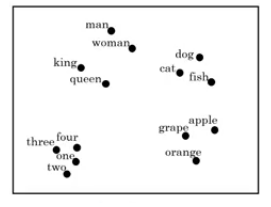
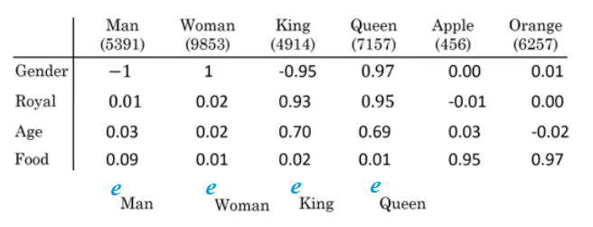
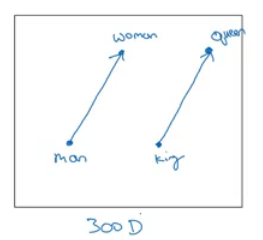
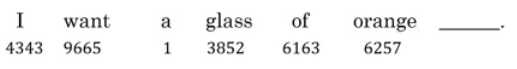
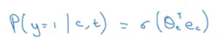
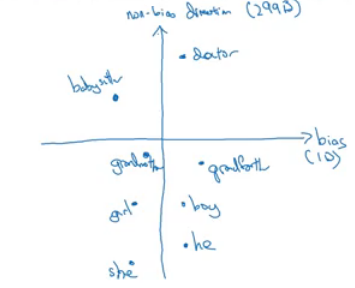

# Natural Language Processing & Word Embeddings

> Natural language processing with deep learning is an important combination. Using word vector representations and embedding layers you can train recurrent neural networks with outstanding performances in a wide variety of industries. Examples of applications are sentiment analysis, named entity recognition and machine translation.

### Introduction to Word Embeddings

#### Word Representation
- NLP has been revolutionized by deep learning and especially be RNNs and deep RNNs.
- Word embeddings is a way of representing words. It lets your algorithm automatically understand the analogies between words like "king" and "queen".
- So far we have defined our language by a vocabulary. Then represented our words with one hot vector that represent the word in the vocabulary.
  - An image example would be:
    - 
  - We will use the annotation **O** idx for any word that is represented with one hot like in the image.
  - One of  the weaknesses of this representation is that it treats a word as a thing that itself and it doesn't allow an algorithm to generalize across words.
    - For example: "I want a glass of **orange** ______" , a model should predict the next word as **Juice**.
    - A similar example "I want a glass of **apple** ______" , a model won't easily predict **juice** here if it doesn't trained on it. And if so the two examples aren't related although orange and apple are similar.
  - Inner product between any hot encoding word is zero. Also the distances between them are the same.
- So, instead of a one-hot presentation, won't it be nice if we can learn a featurized representation with each of these words: Man, Woman, King, Queen, Apple, and orange?
  - 
  - Each word will have a 300 features with type of float point number for example.
  - Each word column will be 300 dimensional vector which will be the representation.
  - We will use the notation **e**5391 to describe Man word features vector.
  - Now if we went to the examples we descried again:
    -  "I want a glass of **orange** ______" 
    -  I want a glass of **apple** ______
  - Orange and apple now shares a lot of similar features which makes it easier for an algorithm to generalize between them.
  - We call this representation **Word embeddings**.
- To visualize word embeddings we use t-SNE algorithm to reduce the features to 2 dimensions which makes it easy to visualize. 
  - 
  - You will get a sense that more related words distance are smaller than other distances.
- The **word embeddings** came from that we need to embed a unique vector inside an n dimensions.

#### Using word embeddings
- Lets see how we can take the feature representation we have extracted from each word and apply it in Name entity recognition problem.
- Given this example - From named entity recognition - :
  - 
- **Sally Johnson** is a persons name.
- After training on this sentence the model should find out that the sentence "**Robert Lin** is an *apple* farmer" contains Robert Lin as a name, as apple and orange has near representations.
- Now if you have tested your model with this sentence "**Mahmoud Badry** is a *durian* cultivator" the network should learn the name even if it hasn't seen the word *durian* before. Thats the power of word representations.
- The algorithms that are used to learn **word embeddings** can exterminate billions of unlabeled text - for example 100 billion- words and learn the representation from them.
- Transfer learning and word embeddings:
  1. Learn word embeddings from large text corpus. say 100 billion word
     - Or download pre-trained embedding online.
  2. Transfer embeddings to new task with smaller training set. say 100k word.
  3. Optimal: Continue to finetune the word embeddings with new data.
     - This can be done if your smaller training set are big enough.
- Also one of the advantages of using word embeddings is that it reduces the size of the input!
  - 10,000 one hot compared to 300 features vector.
- Word embeddings has an interesting relationship to the face recognition task:
  - 
  - In this problem we encode each face into a vector and then check how similar is these vectors.
  - The word **encode** and **embeddings** has a similar meaning here.
  - In the word embeddings task, we are getting a vector say from e1 to e300 for each word in our vocabulary. We will discuss the algorithm in the next sections.

#### Properties of word embeddings
- One of the most fascinating properties of word embeddings is that they can also help with analogy reasoning. Analogy reasoning is one of the most important applications of NLP.
- Analogies example:
  - Given this word embeddings table:
    - 
  - Can we conclude this relation:
    - Man ==> Woman
    - King ==> ??
  - Lets subtract eMan from eWoman. This will equal the vector `[-2  0  0  0]`
  - Similar eKing - eQueen = `[-2  0  0  0]`
  - So the difference is about the gender in both.
    - 
    - This vector represents the gender.
    - This drawing is 2D visualization of the 4D vector that has been extracted by t-SNE algorithm. It was drawing for just clarification! Don't rely on t-SNE algorithm in finding parallels.
  - So we can reformulate the problem to find:
    - eMan - eWoman ≈ eKing - e??
  - It can also represented mathematically by:
    - 
  - It turns out that eQueen is the best solution here that gets the the similar vector.
- Cosine similarity:
  - Equation:
    - 
    - $$\text{CosineSimilarity(u, v)} = \frac {u . v} {||u||_2 ||v||_2} = cos(\theta)$$
    - The top part represents the inner product of `u` and `v` vectors. That will be large if the vectors are so similar.
  - We can use this equation to calculate the similarities between word embeddings and on the analogy problem where `u` = ew and `v` = eking - eman + ewoman

#### Embedding matrix
- When you implement an algorithm to learn a word embedding, what you end up learning is an **<u>embedding matrix</u>**.
- Lets take an example:
  - Suppose we are using 10,000 words as our vocabulary.
  - The algorithm should extract a matrix `E` of the shape (300, 10,000) in case we are extracting 300 features. (300, 10,001) if we have `<UNK>` token.
    - 
  - If O6257 is the one hot encoding of the word **orange**, then `E`. O6257 equals e6257 which shape is (300, 1)
  - Generally `E`. Oj  = ej
- In the next sections you will see that we first initialize `E` randomly and then try to learn all the parameters of this matrix.
- In practice its not efficient to use a dot multiplication when you are trying to extract the embeddings of a specific word, instead we will use slicing to slice a specific column. In keras there are a embedding layer that extracts this column with no multiplications!

### Learning Word Embeddings: Word2vec & GloVe

#### Learning word embeddings
- Lets start learning some algorithms that learns the word embeddings.
- At start, word embeddings algorithms - with deep learning - were complex but then it started to be simpler and simpler.
- We will start by learning the complex examples to make more sense.
- **<u>Neural language model</u>**:
  - Lets start by example:
    - 
  - We want to build a language model so that we can predict the next word.
  - So we use this neural network to learn the language model
    - 
    - We get ej by `E`. oj
    - NN layer has parameters `W1` and `b1` while softmax layer has parameters `W2` and `b2`
    - Input dimension is (300*6, 1) if we the window size is 6.
    - Here we are optimizing `E` matrix and layers parameters. We need to maximize the likelihood in our training set.
  - This model was build on 2003 and tends to work very well to get the embeddings.
- In the last example we took a window of 6 words that fall behind the word that we want to predict. There are other choices when we are trying to learn word embeddings.
  - Suppose we have the example: "I want a glass of orange **juice** to go along with my cereal"
  - To learn juice, Choices of **Context** are:
    1. Last 4 words.
       - We use a window of last 4 words - 4 is the best -, "<u>a glass of orange</u>" and try to predict the next word from it.
    2. 4 words on the left and on the right.
       - "<u>a glass of orange</u>" and "<u>to go along with</u>"
    3. Last 1 word.
       - "<u>orange</u>"
    4. Nearby 1 word.
       - "<u>glass</u>" word is near juice
       - The idea of **skip grams** model. 
       - The idea is so simpler and works remarkably well.
       - We will talk about this in the next section.

#### Word2Vec
- Before presenting Word2Vec, lets talk about **Skip-grams**:

  - For example if we have the sentence: "I want a glass of orange juice to go along with my cereal"

  - We will choose Context and target.

  - The target is chosen randomly basing on a window with a specific size.

  - | Context | Target | How far |
    | ------- | ------ | ------- |
    | orange  | juice  | +1      |
    | orange  | glass  | -2      |
    | orange  | my     | +6      |

    We have converted the problem into a supervised problem.

  - This is not an easy learning problem because within -10/+10 words for example is hard.

  - We want to learn this to get our word embeddings model.

- Word2Vec model:

  - Vocabulary size = 10,000 word
  - Lets say that the context word are `c` and the target word are `t`
  - We want to learn `c` to `t`
  - we get ec by `E`. oc
  - We then use a softmax layer to get `P(t|c)` which is y^
  - Also we will use the cross-entropy loss function.
  - This model is called skip-grams model.

- The last model has a problem with the softmax classifier:

  - 
  - Here we are summing 10,000 numbers which corresponds to the number of words in our vocabulary.
  - If this number is larger say 1 million, the computation will become so slow.

- The solution for the past problem is to use "**Hierarchical softmax classifier**" which works as a tree classifier.

  - 

- In practice the hierarchical softmax classifier doesn't use a balanced tree like the drawn one. Common words are in the top and less common are in the bottom.

- How to sample the context c?

  - One way is to choose the context by random from your corpus.
  - If you have done it that way, there will be frequent words like "the, of, a, and, to, .." that can dominate other words like "orange, apple, Mahmoud,..."
  - So in practice, we don't take the context uniformly random, instead there are some heuristics to balance the common words and the non-common words.

#### Negative Sampling
- Negative sampling allows you to do something similar to the Skip-Gram model, but with a much more efficient learning algorithm. We will create a different learning problem

- Given this example:

  - "I want a glass of orange juice to go along with my cereal"

- The sampling will look like this:

- | Context | Word  | target |
  | ------- | ----- | ------ |
  | orange  | juice | 1      |
  | orange  | king  | 0      |
  | orange  | book  | 0      |
  | orange  | the   | 0      |
  | orange  | of    | 0      |

  We get positive example by using the same skip-grams technique, a fixed window that goes around.

- To generate a negative example, we pick a word randomly from the vocabulary.

- Notice that we got "of" although it was appeared in the same sentence.

- So the steps to generate the samples are:

  1. Pick a positive context
  2. Pick a k negative contexts from the dictionary.

- K is recommended to be from 5 to 20 in small datasets. For larger ones 2 to 5.

- We will have a k negative examples to 1 positive ones in the data we are collecting.

- Now lets define the model that will learn this supervised learning problem:

  - Lets say that the context word are `c` and the word are `t` and `y` is the target.
  - We will apply the simple logistic regression model.
  - 
  - The logistic regression model can be drawn like this:
  - 
  - So we are like having 10,000 binary classification problem, and we only train k+1 classifier of them in each iteration.

- Now how to select negative samples:

  - We can sample according to empirical frequencies in words corpus which means according to how often different words appears. But the problem with that is that we will have more frequent words like the, of, and..
  - The best is to sample with this equation - According to authors - :
    - 

#### GloVe word vectors
- GloVe is another algorithm for learning the word embeddings, Its the simplest of them.
- This is not used much as word2vec or gram models, but it has some enthusiasts because of its simplicity.
- GloVe stands for Global vectors for word presentation.
- Given this example:
  - "I want a glass of orange juice to go along with my cereal"
- We will choose a context and a target from the choices we have mentioned in the previous sections.
- Then we will calculate this for every pair, Xct = # times `t` appears in context of `c`
- Xct = Xtc if we choose a window pair, but they will not equal if we choose the previous words for example. In GloVe they use a window which means they are equal
- The model is defined like this:
  - 
- f(x) -the weighting term- is used for many reasons which includes:
  - The `log(0)` problem, which might occur if there are no pairs for the given target and context values.
  - Giving low weights for stop words like "is", "the", and "this" because they occurs a lot.
  - Giving low weights for words that doesn't occur so much.
- ceta and e are symmetric which helps getting the final word embedding. 
- Conclusion on word embeddings:
  - If this is your first try, you should try to download a pretrained model that has been made and actually works best.
  - If you have enough data, you can try to implement one of the available algorithms.
  - Because word embeddings are very computationally expensive to train, most ML practitioners will load a pre-trained set of embeddings.
  - A final note that you can't guarantee that the axis used to represent the features will be well-aligned with what might be easily humanly interpretable axis like gender, and royal, and age.

### Applications using Word Embeddings

#### Sentiment Classification
- As we have discussed before, Sentiment classification is the process of finding if a text has a positive or a negative review. Its so useful in NLP and is used in so many applications. An example would be:
  - 
- One of the challenges with it, is that you might haven't a huge labeled training data for it, but using word embeddings can help getting rid of this.
- The common dataset sizes varies from 10,000 to 100,000 words.
- A simple sentiment classification model would be like this:
  - 
  - The embedding matrix may have been trained on say 100 billion words.
  - Number of features given a word is 300.
  - We can use **sum** or **average** given all the words then pass it to a softmax classifier. That makes this classifier works for short or long sentences.
- One of the problems with this simple model is that it ignores words order! for example "Completely lacking in **good** taste, **good** service, and **good** ambience" has the word good 3 times but its a negative review!
- A better model uses an RNN for solving this problem:
  - 
  - And so if you train this algorithm, you end up with a pretty decent sentiment classification algorithm.
  - Also it will generalize even if words aren't in your dataset, for example the sentencte "Completely **<u>absent of</u>** good taste, good service, and good ambience" will be the same as the trained word!

#### Debiasing word embeddings
- We want to make sure that our word embeddings free from undesirable forms of bias, such as gender bias, ethnicity bias and so on.
- A horrifying result on a trained word embeddings in the context of Analogies:
  - Man : Computer_programmer as Woman : **Homemaker**
  - Father : Doctor as Mother : **Nurse**
- Word embeddings can reflect gender, ethnicity, age, sexual orientation, and other biases of text used to train the model.
- Learning algorithms by general is making an important decision and it mustn't be biased.
- Andrew thinks we actually have better ideas for quickly reducing the bias in AI than for quickly reducing the bias in the human race, although it still needs a lot of work to be done.
- Addressing bias in word embeddings steps:
  - Idea is by paper: https://arxiv.org/abs/1607.06520
  - Given this learned embeddings: 
    - 
  - We need to solve the **gender bias** here. The steps we will discuss can help solve any bias problem but we are focusing here on gender bias.
  - Here are the steps:
    1. Identify the direction:
       - Calculate the difference between:
         - ehe - eshe
         - emale - efemale
         - ....
       - Choose some k differences and average them.
       - This will help you find this:
         - 
       - By that we have found the bias direction which is 1D vector and the non-bias vector which is 299D vector.
    2. Neutralize: For every word that is not definitional, project to get rid of bias.
       - Babysitter and doctor needs to be neutral so we project them on nonbias with the direction of the bias:
         - 
         - After that they will be equal in the term of gender.
         - To do this the authors of the paper trained a classifier to tell the words that they need to be  neutralized or not.
    3. Equalize pairs
       - We want each pair to have difference only in gender. Like:
         - Grandfather - Grandmother
         - He - She
         - Boy - Girl
       - We want to do this because the distance between grandfather and babysitter is bigger than babysitter and grandmother:
         - 
       - To do that, we move grandfather and grandmother to a point where they will be in the middle of the non-bias axis.
       - There are some words you need to do this for in your steps. The size of these words are relatively small.
