# Sequence models & Attention mechanism

> Sequence models can be augmented using an attention mechanism. This algorithm will help your model understand where it should focus its attention given a sequence of inputs. This week, you will also learn about speech recognition and how to deal with audio data.

### Various sequence to sequence architectures

#### Basic Models
- In this section we will learn about sequence to sequence - Many to Many -  models which are useful in various applications including machine translation and speech recognition.
- Lets start by the basic model:
  - Given this machine translation problem in which X is a French sequence and Y is an English sequence.
    - 
  - Our architecture will include **encoder** and **decoder**.
  - The encoder is built with RNNs - LSTM or GRU are included - and takes the input sequence and then outputs a vector that should represent the whole input.
  - After that the decoder network, are also built with RNNs and outputs the output sequence using the vector that has been built by the encoder.
  - 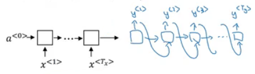
  - These ideas are from these papers:
    - [[Sutskever](https://arxiv.org/abs/1409.3215) et al., 2014. Sequence to sequence learning with neural networks]
    - [[Cho et](https://arxiv.org/abs/1406.1078) al., 2014. Learning phrase representations using RNN encoder-decoder for statistical machine translation]
- With an architecture similar to the one previously mentioned works for image captioning problem:
  - In this problem X is an image, while Y is a sentence.
  - The model architecture image:
    - 
  - The architecture uses a CNN pretrained AlexNet as an encoder for the image, and the decoder is an RNN.
  - The ideas are from these papers (They share similar ideas):
    - [[Maoet](https://arxiv.org/abs/1412.6632). al., 2014. Deep captioning with multimodal recurrent neural networks]
    - [[Vinyalset](https://arxiv.org/abs/1411.4555). al., 2014. Show and tell: Neural image caption generator]
    - [[Karpathy](https://cs.stanford.edu/people/karpathy/cvpr2015.pdf) and Li, 2015. Deep visual-semantic alignments for generating imagedescriptions]

#### Picking the most likely sentence
- There are some similarities between the language model we have learned previously, and the machine translation model we have just discussed, but there are some differences as well.
- The language model we have learned as so similar to the decoder of the machined translation model, except for a0
  - 
- The problems formations also are different:
  - In language model: P(y\<1>, ....y\<Ty>)
  - In machine translation: P(y\<1>, ....y\<Ty> | x\<1>, ....x\<Tx>)
- What we don't want in machine translation model, is not to sample the output at random. This may provide some choices as an output. Sometimes you may sample a bad output.
  - Example: 
    - X = "Jane visite l’Afrique en septembre."
    - Y may be:
      - Jane is visiting Africa in September.
      - Jane is going to be visiting Africa in September.
      - In September, Jane will visit Africa.
- So we need to get the best output, this can be take by the equation:
  - 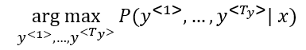
- The most common algorithm is the beam search, which we will explain in the next section.
- Why not use greedy search? Why not get the best choices each time?
  - It turns out that this approach doesn't really work!
  - Lets explain it with an example:
    - The best output for the example we talked about is "Jane is visiting Africa in September."
    - Suppose that you when you are choosing with greedy approach, the first two words were "Jane is", the word that may come after that will be "going" as "going" is the most common word that comes after "Noun is" so the result may look like this: "Jane is going to be visiting Africa in September." and that isn't the best/optimal solution.
- So what is better than greedy approach, is trying to get an approximate solution, that will try to maximize the output.

#### Beam Search
- Beam search is the most widely used algorithm to get the best output sequence. Its a heuristic search algorithm.
- To illustrate the algorithm we will be stick with the example from the previous section. We need Y = "Jane is visiting Africa in September."
- The algorithm has a parameter `B`  which is the beam width. Lets take `B = 3` which means the algorithm will get 3 outputs at a time.
- For the first step you will get ["in", "jane", "september"] words that are the best candidates.
- Then for each word in the first output, get B words from the 3 where the best are the result of multiplying both probabilities. Se we will have then ["In September", "jane is", "jane visit"]. Notice that we automatically ignored September.
- Repeat the same process and get the best B words for ["September", "is", "visit"]  and so so.
- In this algorithm, keep only B instances of your network.
- If `B = 1` this will become the greedy search.

#### Refinements to Beam Search
- In the previous section we have discussed the basic beam search. In this section we will try to do some refinements to it to work even better.
- The first thing is **Length optimization**
  - In beam search we are trying to optimize:
    - 
  - And to do that we multiply:
    - P(y\<1> | x) * P(y\<2> | x, y\<1>) * ..... P(y\<t> | x, y\<y(t-1)>)
  - Each probability is a fraction. Also maybe a small fraction.
  - Multiplying small fractions will cause a **numerical overflow**! Meaning that it's too small for the floating part representation in your computer to store accurately.
  - So in practice we use **summing** **logs** instead of multiplying directly.
    - 
  - But theres another problem. The two optimization functions we have mentions tends to find small sequences! Because multiplying a lot of fractions gives a smaller value.
  - So theres another change , by dividing by the number of elements in the sequence.
    - 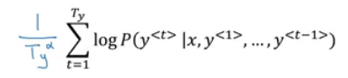
    - alpha is a hyper parameter to tune.
    - If alpha = 0, Then its like we do nothing.
    - If alpha = 1, Then its like we are using full sequence length.
    - In practice alpha = 0.7 is a good thing. 
- The second thing is who can we choose best `B`?
  - The larger B, the larger possibilities, the better are the results. But it will be more computationally expensive.
  - In practice, you might see a in the production sentence `B=10`
  - `B=100`, `B=1000` are uncommon.
  - Unlike exact search algorithms like BFS (Breadth First Search) or  DFS (Depth First Search), Beam Search runs faster but is not guaranteed to find exact solution.

#### Error analysis in beam search
- We have talked before on **Error analysis** in <u>Structuring Machine Learning Projects</u> chapter. We will apply these concepts to improve our beam search algorithm.
- We will use error analysis to figure out if the `B` hyperparameter of the beam search is the problem - because it doesn't get an optimal solution  - or to in other hyperparameters like the RNN parameters.
- Lets take an example:
  - Our examples information:
    - x = "Jane visite l’Afrique en septembre."
    - y* = "Jane visits Africa in September."
    - y^ = "Jane visited Africa last September."
  - Our model that has produced a sentence that are different in meaning because of the word "last"
  - We now want to know who to blame, the RNN or the beam search.
  - To do that, we calculate P(y* | X) and P(y^ | X). There are two cases:
    - Case 1 (P(y* | X)  > P(y^ | X)): 
      - Conclusion: Beam search is at fault.
    - Case 2 (P(y* | X)  <= P(y^ | X)): 
      - Conclusion: RNN model is at fault.
- The error analysis process is as following:
  - You choose N error examples and make the following table:
    - 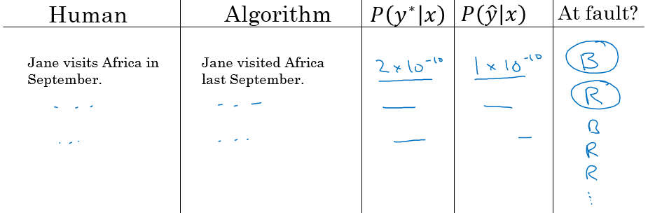
  - `B`  for beam search, `R` is for the RNN.
  - Get counts and decide.

#### BLEU Score
- One of the challenges of machine translation, is that given a sentence in a language there are one or more possible good translation in another language. So how do we evaluate our results?
- The way we do this is by using **BLEU score**. BLEU stands for bilingual evaluation understudy.
- The intuition is so long as the machine generated translation is pretty close to any of the references provided by humans, then it will get a high BLEU score.

- Lets take an example:

  - X = "Le chat est sur le tapis."
  - Y1 = "The cat is on the mat."
  - Y2 = "There is a cat on the mat."
  - Suppose that the machine outputs: "<u>the the the the the the the.</u>"
  - One way to evaluate the machine output is to look at each word in the output and check it in the references. This is called precision:
    - precision = 7/7  because the appeared in Y1 or Y2
  - This is not a useful measure!
  - We can use a modified precision in which we are looking for the reference with the maximum number of a particular word and set the maximum appearing of this word to this number. So:
    - modified precision = 2/7 because the max is 2 in Y1
    - We clipped the 7 times by the max which is 2.
  - The problem here is that we are looking at one word at a time, we may need to look at pairs

- Another example (BLEU score on bigrams)

  - The n-**grams** typically are collected from a text or speech corpus. When the items are words, n-**grams** may also be called shingles. An n-**gram** of size 1 is referred to as a "unigram"; size 2 is a "bigram" (or, less commonly, a "digram"); size 3 is a "trigram".

  - X = "Le chat est sur le tapis."

  - Y1 = "The cat is on the mat."

  - Y2 = "There is a cat on the mat."

  - Suppose that the machine outputs: "<u>The cat the cat on the mat.</u>"

  - The bigrams in the machine output:

  - | Pairs      | Count | Count clip |
    | ---------- | ----- | ---------- |
    | the cat    | 2     | 1 (Y1)     |
    | cat the    | 1     | 0          |
    | cat on     | 1     | 1 (Y2)     |
    | on the     | 1     | 1 (Y1)     |
    | the mat    | 1     | 1 (Y1)     |
    | **Totals** | 6     | 4          |

    Score = Count clip / Count = 4/6

- So here are the equations for the n-grams:

  - 

- Lets put this together to formalize the BLEU score:

  - **Pn** = Bleu score on n-grams only
  - **Combined Bleu score** equation:
    - 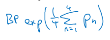
    - For example if we want Bleu for 4, we compute P1, P2, P3, P4 and then average them and take the exp.
  - Another equation is **BP penalty** which stands for brevity penalty. It turns out that if a machine outputs a small number of words it will get a better score so we need to handle that.
    - 

- Blue score is has several open source implementations and used in variety of systems like machine translation and image captioning.

#### Attention Model Intuition

- So far we are using sequence to sequence models with an encoder and decoders. There are a technique called attention which makes these models even better.
- The attention algorithm, the attention idea has been one of the most influential ideas in deep learning. 
- The problem of long sequences:
  - Given this model, inputs, and outputs.
    - 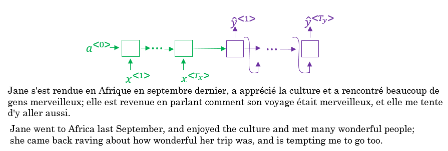
  - The encoder should memorize this long sequence into one vector, and the decoder has to process this vector to generate the translation.
  - If a human would translate this sentence, he wouldn't read the whole sentence and memorize it then try to translate it. He translates a part at a time.
  - The performance of this model decreases if a sentence is so long.
  - We will discuss the attention model that works like a human that looks at parts at a time. That will significantly increase the accuracy even with bigger sequence:
    -  
    -  Blue is the normal model, while green is the model with attention mechanism.
- In this section we will give just some intuitions about the attention model and in the next section we will discuss its details.
- At first the attention model was developed for machine translation but then other applications used it like computer vision and new architectures like Neural Turing machine.
- The attention model was descried in this paper:
  - [[Bahdanau](https://arxiv.org/abs/1409.0473) et. al., 2014. Neural machine translation by jointly learning to align and translate]
- Now for the intuition:
  - Suppose that our decoder is a bidirectional RNN:
    - 
  - We gave the French sentence to the encoder and it should generate a vector that represents the inputs.
  - Now to generate the first word in English which is "Jane" we will make another RNN which is the decoder.
  - attention weights are used to specify which words are needed when to generate a word. So to generate "jane" we will look at "jane", "visite", "l'Afrique"
    - 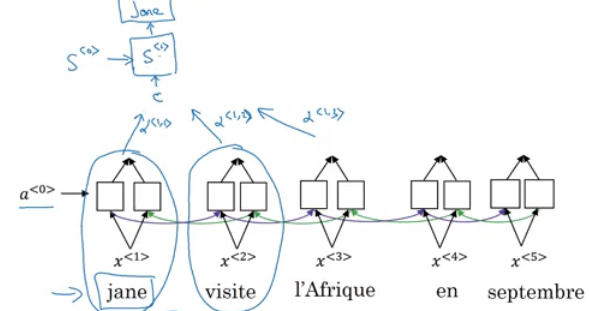
  - alpha1,1, alpha1,2, and alpha1,3 are the attention weights used.
  - And so to generate any word there will be a set of attention weights that controls which words we are looking at right now.
    - 
  - ​

#### Attention Model

- Lets formalize the intuition from the last section into the exact details on how this can be implemented.
- First we will have an bidirectional RNN - most common is LSTMs - that encodes French language:
  - 
- For learning purposes, lets assume that a\<t> will include the both directions.
- We will have an RNN to extract the output using a context `c` which is computer using the attention weights. This denotes how much information do it needs to look in a\<t>
  - 
- Sum of the attention weights for each element in the sequence should be 1:
  - 
- Also the context `c` are calculated using this equation:
  - 
- Lets see how can we compute the attention weights:
  - So alpha\<t, t'> = amount of attention y\<t> should pay to a\<t'>
    - Like for example we payed attention to the first three words through alpha\<1,1>, alpha\<1,2>, alpha\<1,3>
  - We are going to softmax the attention weights so that their sum is 1:
    - 
  - Now we need to know how to calculate e\<t, t'>. We will compute e using a small neural network:
    - 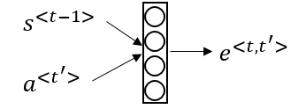
    - s\<t-1> is the hidden state of the RNN s, and a\<t'> is the activation of the other bidirectional RNN. 
- One of the disadvantages of this algorithm is that it takes quadratic time or quadratic cost to run.
- One fun way to see how attention works is by visualizing the attention weights:
  - 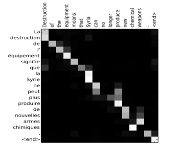

### Speech recognition - Audio data

#### Speech recognition
- The rise of accurate speech recognition was the most exciting work done in sequence to sequence deep learning models.
- Lets define the speech recognition problem:
  - X: audio clip
  - Y: transcript
  - If you plot an audio clip it should look like this:
    - 
    - The horizontal axis is time while the vertical is changes in air pressure.
  - What really is an audio recording? A microphone records little variations in air pressure over time, and it is these little variations in air pressure that your ear also perceives as sound. You can think of an audio recording is a long list of numbers measuring the little air pressure changes detected by the microphone. We will use audio sampled at 44100 Hz (or 44100 Hertz). This means the microphone gives us 44100 numbers per second. Thus, a 10 second audio clip is represented by 441000 numbers (= $10 \times 44100$).
  - It is quite difficult to work with "raw" representation of audio.
  - Because even human ear doesn't process raw wave forms, the human ear can process different frequencies.
  - There's a common preprocessing step for an audio to generate a spectrogram which works similarly to human ears.
    - 
    - The horizontal axis is time while the vertical is frequencies. Intensity of different colors shows the amount of energy.
  - A spectrogram is computed by sliding a window over the raw audio signal, and calculates the most active frequencies in each window using a Fourier transform.
  - In the past days, speech recognition systems was built with phonemes that are a hand engineered basic units of sound. Linguists use to hypothesize any writing down audio in terms of phonemes which they thought would be the best way to do speech recognition.
  - End to end deep learning found that phonemes was no longer needed. One of the things that made this possible is the large audio datasets.
  - Research papers has 300 - 3000 hours while the best commercial systems are now trained on over 100,000 hours of audio.
- You can build an accurate speech recognition system using the attention model that we have descried in the previous section:
  - 
- One of the methods that seem to work well is CTC cost which stands for "Connectionist temporal classification" 
  - To explain this lets say that Y = "<u>the quick brown fox</u>"
  - We are going to use an RNN with input, output structure:
    - 
  - Hint: this is a bidirectional RNN, but it practice a bidirectional RNN are used.
  - Notice that the number of inputs and number of outputs are the same here, but in speech recognition problem X tends to be a lot larger than Y.
    - 10 seconds of audio gives us X with shape (1000, ). This 10 seconds can't have 1000 character!
  - The CTC cost function allows the RNN to output something like this:
    - `ttt_h_eee\<SPC>___\<SPC>qqq___`
    - This covers from "The quick".
    - The _ is a special character called blank and `<SPC>` is for space character.
  - So the 19 character in our Y can be generated into 1000 character output using CTC and its special blanks.
  - The ideas were taken from this paper:
    - [[Graves](https://dl.acm.org/citation.cfm?id=1143891) et al., 2006. Connectionist Temporal Classification: Labeling unsegmented sequence data with recurrent neural networks]
    - This paper also are used by baidue deep speech.
- Both options attention models and CTC cost can give you an accurate speech recognition system.

#### Trigger Word Detection
- With the rise of deep learning speech recognition, there are a lot of devices that can be waked up by saying some words with your voice. These systems are called trigger word systems.
- For example, Alexa - a smart device made by amazon - can answer your call "Alexa, What time is it" and then Alexa will reply you.
- Trigger word detection system includes:
  - 
- Now the trigger word detection literature is still evolving so there actually isn't a single universally agreed on algorithm for trigger word detection yet. But lets discuss an algorithm that can be used.
- Lets now build a model that can solve this problem:
  - X: audio clip
  - X has been preprocessed and spectrogram features has been returned of X
    - X\<1>, X\<2>, ... , X\<t>
  - Y will be labels 0 or 1. 0 represents the non trigger word, while 1 is that trigger word that we need to detect.
  - The model architecture can be like this:
    - 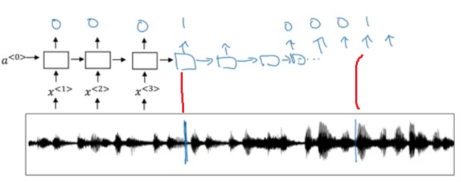
    - The vertical lines in the audio clip represents the trigger words. The corresponding to this will be 1.
  - One disadvantage of this is the imbalanced dataset outputs. There will be a lot of zeros and little ones.
  - A hack to solve this is to make an output a few ones for several times or for a fixed period of time before reverting back to zero.
    - 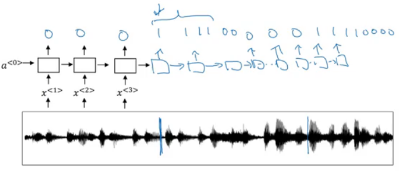
    - 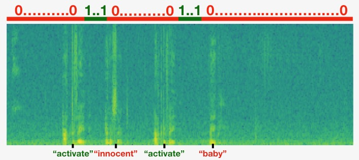
  - ​