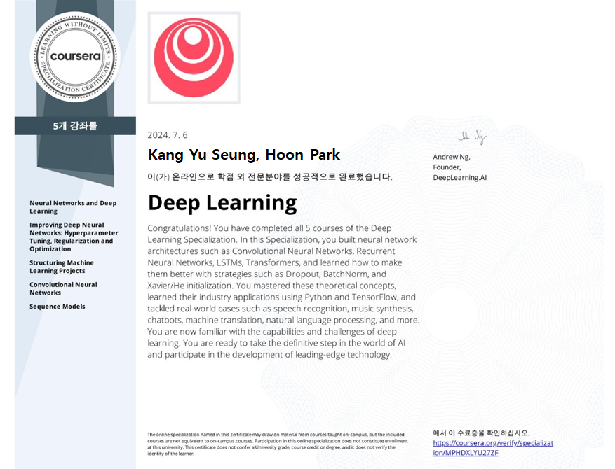

# Deep Learning Specialization

This repository contains my personal notes and summaries on [DeepLearning.ai](https://deeplearning.ai) specialization courses. I've enjoyed every little bit of the course hope you enjoy my notes too.

[DeepLearning.ai](https://deeplearning.ai)  contains five courses which can be taken on [Coursera](https://www.coursera.org/specializations/deep-learning). The five courses titles are:

1. Neural Networks and Deep Learning.
2. Improving Deep Neural Networks: Hyperparameter tuning, Regularization and Optimization.
3. Structuring Machine Learning Projects.
4. Convolutional Neural Networks.
5. Sequence Models.

This is by far the best course series on deep learning that I've taken. Enjoy!

## Specialization Certificate

At last I've successfully completed the specialization and earned my [certificate]()!

