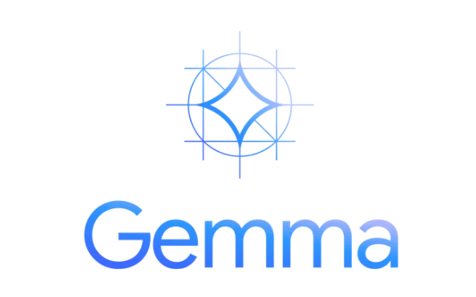

<!--<div align="center">
  
</div> -->

# Gemma 

Gemma, developed in collaboration between Google DeepMind and various Google departments, is a lightweight open model built upon the core technology and research of Gemini.

- Model Availability: Gemma is available in two versions, Gemma 2B and Gemma 7B, both of which come as pre-trained and instruction-tuned models.

- Developer Tools: It integrates seamlessly with widely-used tools like Hugging Face, MaxText, and NVIDIA NeMo, alongside Colab and Kaggle notebooks.

- Framework Support: Gemma offers toolchains for inference and supervised fine-tuning (SFT) on major frameworks such as JAX, PyTorch, and TensorFlow.

- Hardware Optimization: It is optimized for NVIDIA GPUs and Google Cloud TPUs

## Overview 
We use Gemma 2b-it and Hugging Face packages to build a specialized Gemma model for answering questions based on reviews of Squid Game!

1. Extracting knowledge from review data

2. Leveraging Gemma to build meaningful chatbot based on the review base

3. Train Gemma on the review using 4-bit quantization and LoRA

4. Save the trained LoRA weights and merge them back into Gemma

## Fine-Tune the Gemma

``` python
output_dir = "gemma_Squid_Game"

peft_config = LoraConfig(
    lora_alpha=64,
    lora_dropout=0.01,
    r=16,
    bias="none",
    task_type="CAUSAL_LM",
    target_modules = ['q_proj','k_proj','v_proj','o_proj','gate_proj','down_proj','up_proj']
    )

training_arguments = TrainingArguments(
    output_dir=output_dir,
    num_train_epochs=1,
    gradient_checkpointing=True,
    per_device_train_batch_size=16,
    gradient_accumulation_steps=8,
    optim="paged_adamw_32bit",
    save_steps=0,
    logging_steps=25,
    learning_rate=1e-4,
    weight_decay=0.001,
    fp16=True,
    bf16=False,
    max_grad_norm=0.3,
    max_steps=-1,
    warmup_ratio=0.03,
    group_by_length=False,
    evaluation_strategy='steps',
    eval_steps = 500,
    eval_accumulation_steps=1,
    lr_scheduler_type="cosine",
    report_to="tensorboard",
)
```
### Task 1 : Summarize and explain Squid Game

#### Before Fine-Tuning
- **Summary**
  
    Squid Game is a South Korean television series that follows a group of ordinary people lured into a deadly game by a         mysterious figure known as the "Squid Game Creator." The show explores themes of greed, social inequality, and the human     condition.

- **Explanation**

    The show is about greed and social inequality, exploring humanity's darker side. It features suspenseful and       
    unpredictable challenges, focusing on the psychological effects of violence.

#### After Fine-Tuning
- **Summary**

  Squid Game is a South Korean dystopian thriller series following a group of desperate individuals who are chosen through a lottery to participate in a deadly game show. The show delves into themes of poverty, social inequality, and the human     condition.

- **Explanation**

    The show effectively highlights the struggles of the poor and marginalized in South Korea. Through high-stakes survival games, it raises questions about social inequality and human vulnerabilities. The characters are forced to confront their fears and make difficult choices, showcasing the complexity of human nature.

### Task 2 : Positive and Negative Aspects Comparison

#### Before Fine-Tuning
- **Positive Aspects**

  Tackles social issues, superb performances, gripping story, thought-provoking themes, cultural phenomenon.

- **Negative Aspects**

  Graphic violence, controversial themes, unethical production practices, cultural appropriation, psychological impact.

#### After Fine-Tuning
- **Positive Aspects**

  Gripping narrative, intriguing characters, strong social commentary, beautiful cinematography, exceptional performances.

- **Negative Aspects**

  Graphic violence, controversial themes, unrealistic portrayal of poverty, lack of resolution, cultural appropriation.

## Key Improvements Fine-Tuning
- **Clarity and Depth**: Post fine-tuning, the summaries and explanations are more detailed, focusing on deeper themes such as social inequality and human nature.
- **Contextual Accuracy**: The model better captures the core elements of the show, including its social commentary on poverty and marginalization.
- **Balanced Analysis**: Positive and negative aspects are more nuanced, with clear reasoning behind each point.

## Reference
- Hu, E. J., Shen, Y., Wallis, P., Allen-Zhu, Z., Li, Y., Wang, S., Wang, L., & Chen, W. (2021). LoRA: Low-Rank Adaptation of Large Language Models. arXiv preprint arXiv:2106.09685. https://doi.org/10.48550/arXiv.2106.09685
- Dettmers, T., Pagnoni, A., Holtzman, A., & Zettlemoyer, L. (2023). QLoRA: Efficient Finetuning of Quantized LLMs. arXiv preprint arXiv:2305.14314. https://doi.org/10.48550/arXiv.2305.14314
- Riviere, M., Pathak, S., Sessa, P. G., Hardin, C., Bhupatiraju, S., Hussenot, L., et al. (2024). Gemma 2: Improving Open Language Models at a Practical Size. arXiv preprint arXiv:2408.00118. https://doi.org/10.48550/arXiv.2408.00118
